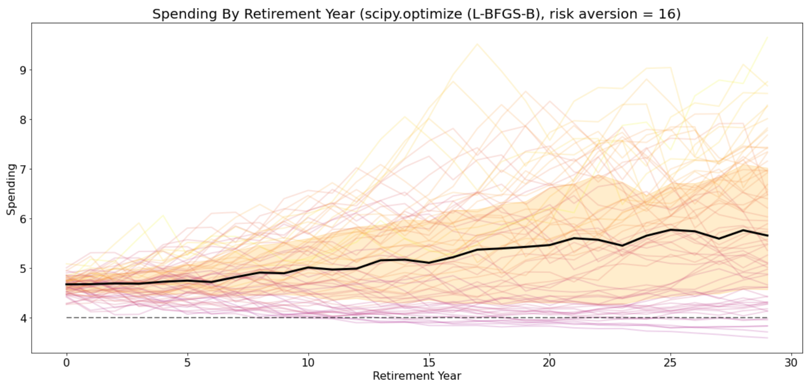
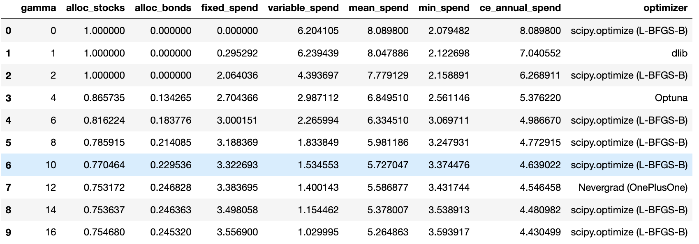

# swr - Safe Withdrawal for Retirement

A Python module for determining safe withdrawal rates, designed to accommodate:

- Any generator of asset returns (historical cohorts, Monte Carlo, roll your own market environment)
- Any asset allocation strategy (fixed weights, glidepath schedules, roll your own based on any parameters)
- Any withdrawal strategy (fixed withdrawal, variable percentage, combinations, glidepaths)
- Any metrics to evaluate retirement cohort outcomes (e.g. total spending, certainty equivalent spending, roll your own. Support for survival tables, i.e. calculate expected metric for living retirees taking into account retirement age and survivorship)
- Any (gradient-free) optimizer to find optimal parameters (e.g. asset allocation, withdrawal parameters) to maximize a metric in the given market environment

